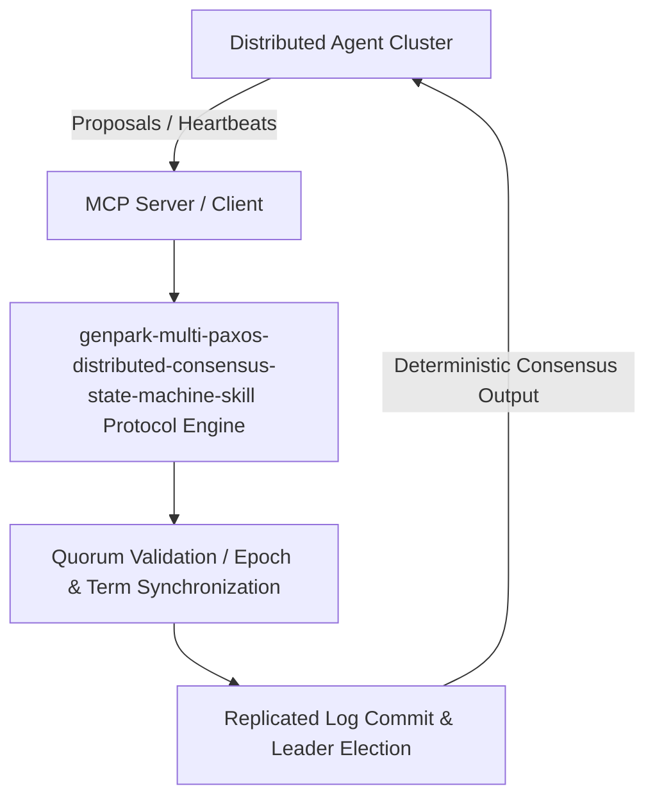

# genpark-multi-paxos-distributed-consensus-state-machine-skill

[](https://github.com/Alpha-Park/genpark-multi-paxos-distributed-consensus-state-machine-skill)
[](https://python.org)
[](#)
[](#)
[](LICENSE)

> Multi-Paxos distributed consensus protocol with Phase 1 prepare/promise leader lease optimization, Phase 2 accept/commit log ordering, and log gap compaction.

## Architecture Overview



## Features
- **0 External Pip Dependencies**: Pure Python standard library implementation.
- **MCP Protocol Ready**: Includes Model Context Protocol server script (`mcp_server.py`).
- **Production Standard**: Quorum proofs, failover simulations, zero drift.

## Quick Start
```bash
python example_usage.py
```
